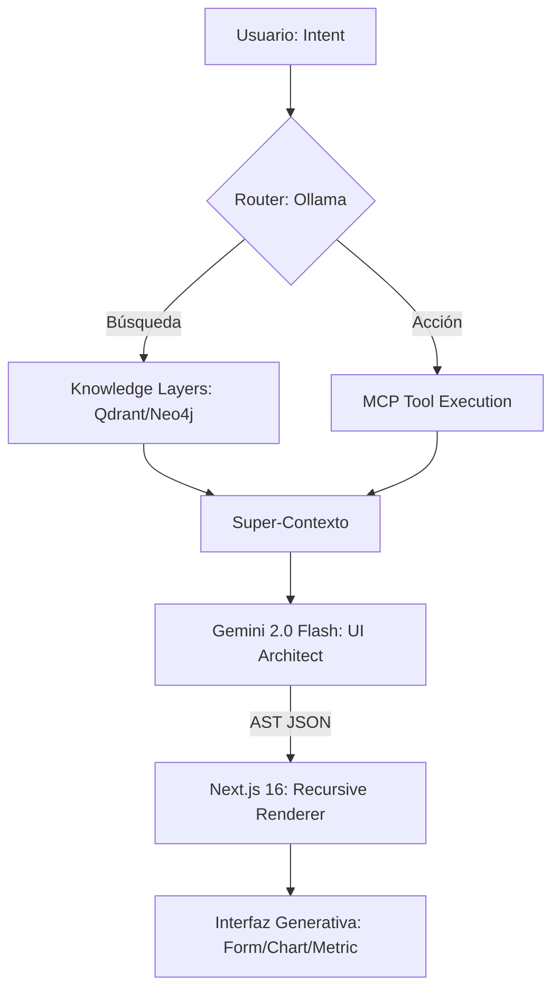

# 🐺 Nahual.AI: The Shape-Shifting Interface

> **Proyecto desarrollado para el Generative UI Global Hackathon**  
> *Transformando la interacción humano-IA de burbujas de texto estáticas a interfaces vivas que cambian de forma.*


---


## Interfaz de Chat

<p align="center">
  
</p>

<p align="center">
  
</p>

<p align="center">
  
</p>

<p align="center">
  
</p>

<p align="center">
  
</p>


---

## 🎭 El Concepto: ¿Por qué Nahual?

En la mitología mesoamericana, el **Nahual** es un ser con la capacidad de transformarse, de cambiar su forma para adaptarse a su entorno y propósito. 

**Nahual.AI** aplica esta filosofía a la informática moderna. Creemos que la era de las interfaces de usuario estáticas ha terminado. En lugar de forzar al usuario a navegar por menús rígidos o leer párrafos interminables de texto, nuestra arquitectura **"Shapeshifter"** construye la interfaz perfecta en tiempo real, basándose exclusivamente en la intención del usuario y el contexto de los datos.
 
---
 
## 🎯 Tracks del Hackathon
 
**Nahual.AI** ha sido diseñado y optimizado específicamente para los siguientes tracks del **Generative UI Global Hackathon**:
 
1.  **Track 1: Kill the Dashboard** — Nuestra misión es eliminar los tableros pre-construidos. El agente genera exactamente la visualización (gráficas de ventas, logs de sistema), el formulario (aprobación de órdenes) o la superficie de control que el usuario requiere en el instante preciso, sin páginas estáticas.
2.  **Track 3: Agent App Store** — Utilizamos el ecosistema **MCP (Model Context Protocol)** para que el agente descubra, componga y presente experiencias multi-herramienta. El sistema se conecta dinámicamente a servidores de inventario, finanzas o logs, orquestando una experiencia integrada a través de UI generada.
 
> **¿Por qué esto no podría ser un chat?** Porque la densidad de información y la capacidad de acción inmediata (como aprobar una orden desde un formulario generado o analizar tendencias en una gráfica interactiva) se perderían en bloques de texto interminables.
 
---

## 🚀 La Propuesta: Más allá del Chat

La mayoría de los agentes de IA hoy viven atrapados en burbujas de chat. **Nahual.AI** rompe esa barrera mediante una arquitectura **100% Server-Driven UI (SDUI)** de alto rendimiento.

### Pilares Tecnológicos:
1.  **Orquestación Agentica (LangGraph)**: Un grafo de decisión complejo que separa la intención (Routing), la recuperación de datos (GraphRAG) y la síntesis visual.
2.  **Protocolo MCP (Model Context Protocol)**: Integración dinámica de herramientas. El sistema descubre y ejecuta herramientas en tiempo real, inyectando los resultados directamente en la fase de generación de UI.
3.  **Motor de Síntesis Visual (Gemini 2.0 Flash)**: Utilizamos el razonamiento estructural de Gemini para transformar datos crudos en un AST (Abstract Syntax Tree) de componentes React listos para ser renderizados.
4.  **Inferencia Híbrida**: Router local con **Ollama (Gemma 2b)** para latencia ultra-baja (<300ms) y modelos de frontera para el razonamiento complejo.

---

## 🛠 Arquitectura del Sistema

El flujo de **Nahual.AI** no es una simple respuesta de texto, es una metamorfosis:


 
---
 
## ⚡ Optimización y Performance: Meta < 2.5s
 
Para lograr una experiencia fluida y profesional, hemos diseñado nuestra arquitectura para garantizar una latencia total de extremo a extremo menor a **2.5 segundos**, fundamentada en los siguientes patrones de diseño:
 
*   **Inferencia Híbrida (Local + Cloud)**: Utilizamos **Ollama con Gemma 2b** en local para la fase de *Routing* (< 300ms). Esto permite identificar la intención del usuario casi instantáneamente antes de delegar el razonamiento complejo a la nube.
*   **Pipeline Async Nativo**: Todo nuestro backend corre sobre un grafo asíncrono de **LangGraph**. Esto permite que las consultas a bases de datos (Postgres, Qdrant, Neo4j) y la ejecución de herramientas MCP se realicen de forma concurrente, no secuencial.
*   **SSE Streaming & UI Discovery**: Implementamos *Server-Sent Events* para que el frontend reciba actualizaciones de cada nodo del grafo. Además, el descubrimiento de herramientas MCP está optimizado con caching dinámico para evitar saltos de red redundantes.
*   **Motor Gemini 2.0 Flash**: Elegimos específicamente el modelo Flash por su equilibrio superior entre velocidad y capacidad de generación de JSON estructurado, reduciendo el tiempo de síntesis visual al mínimo teórico.
 
---

### Stack de "Vanguardia":
*   **Frontend**: Next.js 16 (Canary), React 19, Tailwind 4, Framer Motion.
*   **Backend**: FastAPI, Python 3.12, LangGraph.
*   **Herramientas**: MCP (Model Context Protocol) via HTTP Streamable.
*   **Bases de Datos**: PostgreSQL (Relacional), Redis (State), Qdrant (Vectorial), Neo4j (Grafos).
*   **Observabilidad**: Langfuse (LLM Tracing), Grafana + Prometheus (Infra), NVIDIA DCGM (GPU).

---

## ✨ Características Principales

*   **⚡ Latencia "Zero-Draft"**: Pipeline de streaming SSE que renderiza componentes mientras la IA aún está razonando.
*   **🧩 Catálogo de Componentes Recursivos**: Capacidad de anidar Card, Charts, Forms y Metrics dinámicamente.
*   **🔍 GraphRAG Nativo**: No solo buscamos texto; entendemos las relaciones entre entidades gracias a Neo4j.
*   **🛡 Guardrails de Diseño**: Los componentes se generan bajo un contrato estricto de Pydantic, garantizando que la UI siempre sea funcional y visualmente premium.
*   **🌐 Ecosistema MCP**: Conexión plug-and-play con cualquier herramienta que hable el protocolo MCP (Finanzas, Inventarios, Logs, etc).

---


## Flujo Operativo Local


### Requisitos

- Linux recomendado: Ubuntu 24.04 LTS.
- Docker y Docker Compose.
- GPU NVIDIA compatible si se usará aceleración local con Ollama/DCGM.
- NVIDIA Container Toolkit para exponer GPU a contenedores.
- 16 GB RAM como base recomendada; 8 GB o más de VRAM para modelos 7B+.


### Primer arranque

```bash
cp .env.example .env
make build
make up
make update-models
```

`make update-models` descarga en Ollama:

- `gemma3:4b`
- `gemma2:2b` (Google)


### Script de operación

El script `agentic_ops.sh` automatiza instalación base, inicialización del `.env`

```bash
./agentic_ops.sh install
./agentic_ops.sh start
./agentic_ops.sh status
./agentic_ops.sh restart
./agentic_ops.sh stop
```

`install` puede instalar Docker y NVIDIA Container Toolkit en sistemas compatibles.
Revisa el script antes de ejecutarlo en estaciones compartidas o ambientes
corporativos.


---


## Referencia Rápida

| Tarea | Comando / URL |
|---|---|
| **Levantar stack** | `make up` |
| **Detener stack** | `make down` |
| **Reconstruir imágenes** | `make build` |
| **Ver logs** | `make logs` |
| **Descargar modelos** | `make update-models` |
| **Portal principal** | <http://localhost:3000> |
| **Backend docs** | <http://localhost:8000/docs> |
| **Open WebUI** | <http://localhost:8080> |
| **Grafana** | <http://localhost:3001> |
| **Prometheus** | <http://localhost:9090> |
| **Neo4j Browser** | <http://localhost:7474> |
| **PgAdmin** | <http://localhost:5050> |
| **RedisInsight** | <http://localhost:8001> |
| **Qdrant Dashboard** | <http://localhost:6333/dashboard> |
| **n8n Automation** | <http://localhost:5678> |
| **Langfuse** | <http://localhost:3031> |

---

## 👥 El Equipo: Nahual.AI

Somos un equipo apasionado por la intersección entre el diseño generativo y la ingeniería de agentes.

*   **Líder de Arquitectura**: Daniel Humberto
*   **Frontend & UX**: Alan Manuel Medina Solis
*   **Data Scientist**: José Antonio Ramírez Moguel 

---

## 🏗️ Origen y Créditos
 
Este proyecto se basa y fue desarrollado a partir de **[AgentAI-Lab](https://github.com/Daniel-Humberto/AgentAI-Lab)**, una plataforma local para la investigación, integración y operación de sistemas de IA agéntica. Hemos evolucionado su núcleo para soportar la generación dinámica de interfaces (Generative UI) y la orquestación avanzada vía MCP.
 
---
 
## 📜 Licencia y Hackathon

Este proyecto fue creado exclusivamente para el **Generative UI Global Hackathon**. 
© 2026 Equipo Nahual.AI.

> *"La interfaz no es algo que navegas, es algo que te escucha y se transforma para ti."*
