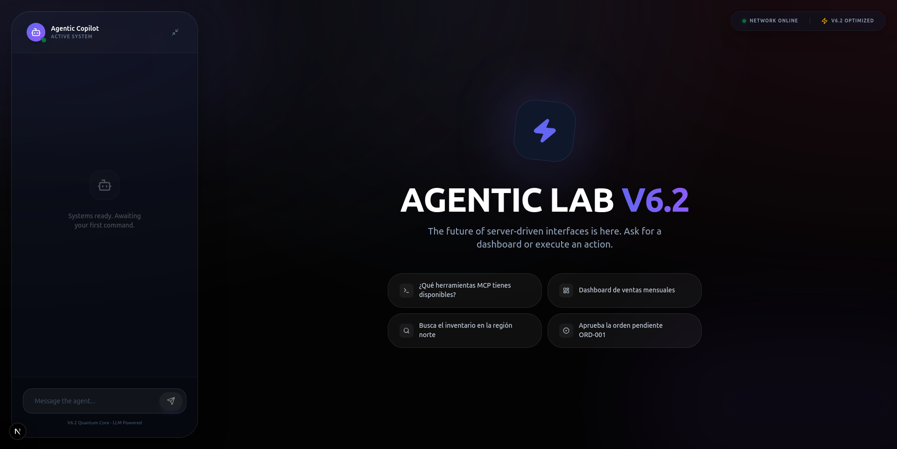
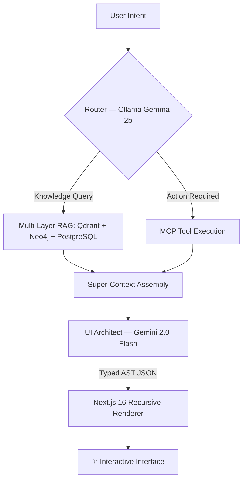
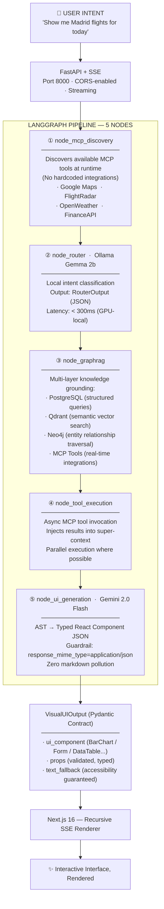
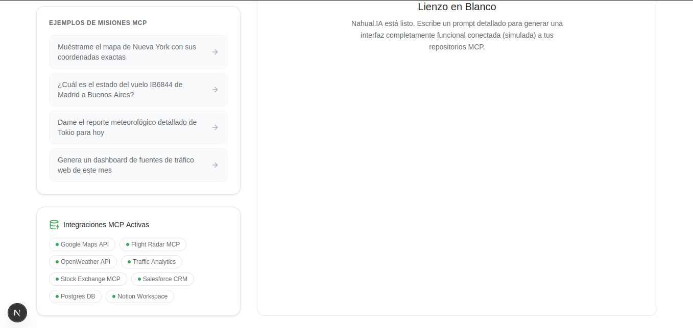
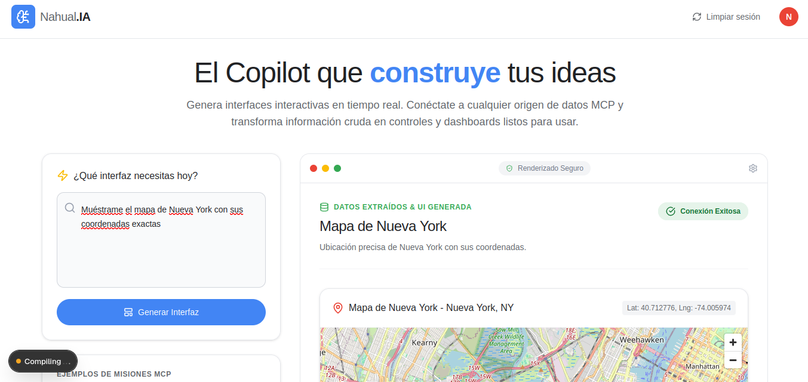
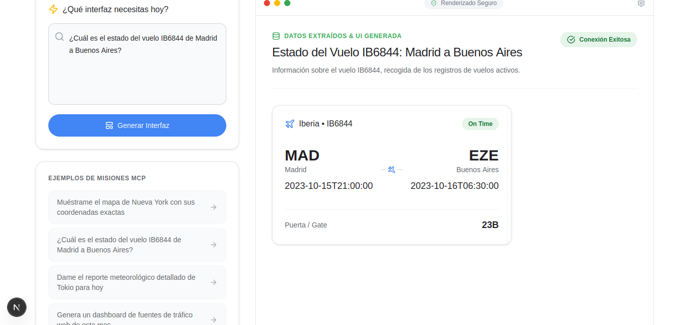
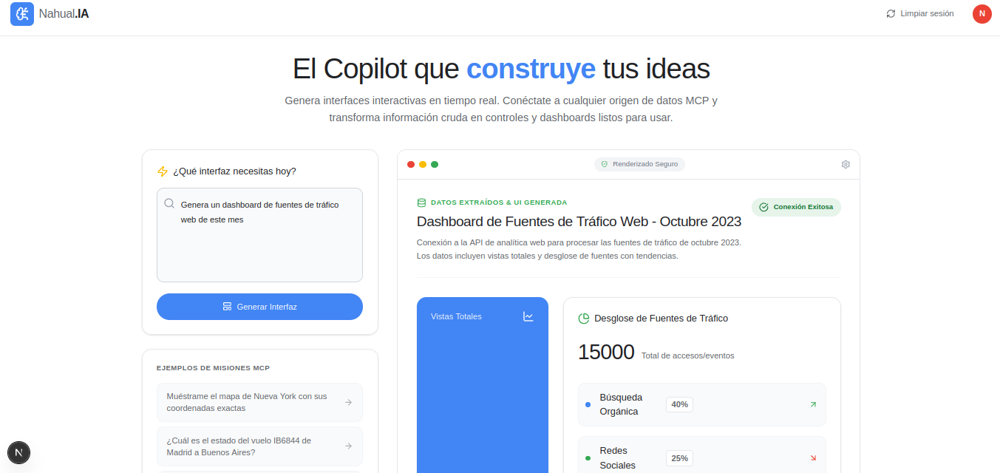
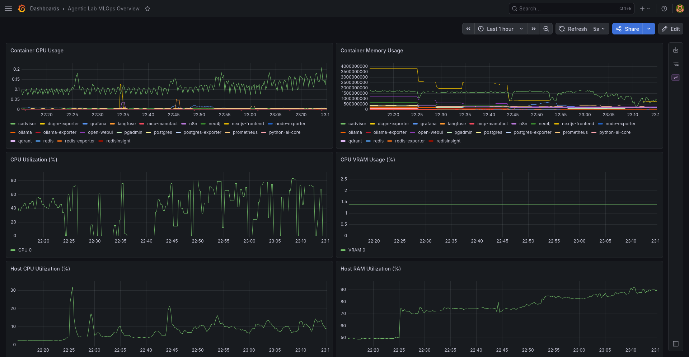
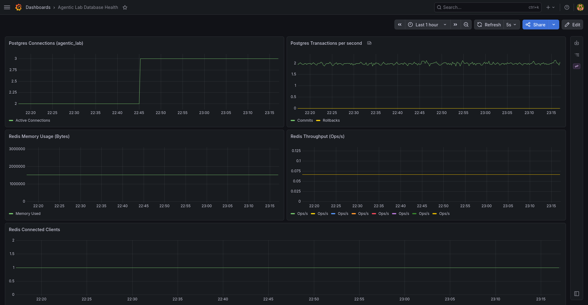

# 🐺 Nahual.AI — The Shape-Shifting Interface


<p align="center">
  <strong>Generative UI Global Hackathon 2026 · Agentic Interfaces</strong><br/>
  <em>Presented by AI Tinkerers · Google DeepMind · CopilotKit</em>
</p>


<p align="center">
  
</p>


<p align="center">
    🐺 <em>In the mythology of our ancestors, the Nahual transforms in the blink of an eye.<br/>
  In ours, so does the interface.</em>
</p>


---


## ✦ The Origin: Why Nahual?

In Mesoamerican mythology, the **Nahual** (*nahualli* in classical Nahuatl) is no ordinary spirit. It is a shapeshifter — an entity capable of shedding its form and assuming another in an instant, adapting completely to the demands of its environment and purpose. The Nahual does not hesitate. It perceives intent, transforms, and acts.

**This is exactly the metaphor we needed.**

The vast majority of AI agents built today are, at their core, stateless text machines. They receive a prompt and emit a paragraph. They are powerful, yes — but they are static. They do not adapt their *form* to their purpose; they impose the same form — a chat bubble — onto every task, regardless of whether that task demands a chart, a workflow, an approval form, or a real-time dashboard.

**Nahual.AI breaks that constraint.** When a user types a query, the system does not merely answer — it *transforms*. It generates the precise interactive interface the intent demands: live data tables, multi-step approval flows, KPI cards with trend lines, flight status widgets, geospatial maps. The interface shapeshifts to match the task. Zero static screens. Zero pre-built dashboards. Pure, agentic generation.

> *"No es un chatbot más, ni una interfaz que navegas — es un sistema que evoluciona y se adapta a ti."*


---


## 🎯 Executive Summary

**Nahual.AI** is a production-grade **Server-Driven UI (SDUI)** platform that translates natural language into fully functional, interactive React interfaces in real time. Built on a multi-agent LangGraph pipeline with hybrid inference, multi-layer knowledge retrieval, and a typed component contract system, the architecture consistently achieves:

- **End-to-end latency < 2.5 seconds** from query to rendered interactive component
- **Zero hallucinated UI** via Pydantic-validated JSON contracts and Qdrant-grounded component schemas
- **16-container self-hosted infrastructure** with full LLM observability (Langfuse, Prometheus, Grafana, DCGM)
- **Dynamic MCP tool discovery** — the agent composes multi-tool workflows without hardcoded integrations

This is not a demo. This is a production-aligned system built from infrastructure upward, with AIOps principles, IaC, clean architecture, and SOLID design guiding every layer.


---


## 🏆 Hackathon Track Alignment

Nahual.AI was architected to address two tracks simultaneously, as they represent two sides of the same paradigm shift:


### Track 1 · Kill the Dashboard

> *The challenge: eliminate static, pre-built dashboards. Generate exactly what the user needs, when they need it.*

Traditional BI dashboards are a form of UI debt. They are designed by analysts who predict what users will want, built by engineers who implement those predictions, and navigated by users who must contort their actual questions to fit the available views. The insight-to-action path is long, lossy, and inflexible.

**Nahual.AI inverts this.** The user expresses intent in natural language. The pipeline classifies that intent, retrieves grounded data across three knowledge layers (PostgreSQL, Qdrant, Neo4j), and instructs Gemini 2.0 Flash to synthesize a component AST — a `BarChart`, a `DataTable`, a `StatCard` cluster — that is rendered live in the browser. No predefined page exists. The interface is the answer.


### Track 3 · Agent App Store

> *The challenge: build multi-tool agentic experiences with MCP that feel native and coherent.*

A single data source is rarely enough for real enterprise queries. "Which orders failed overnight, who approved them, and what does the current inventory look like?" requires SQL joins, graph traversal, and a live API call — coordinated seamlessly.

**Nahual.AI's `node_mcp_discovery` node** enumerates all available tools from the MCP server at runtime, before routing. The router then selects which tools are needed based on intent, `node_tool_execution` invokes them asynchronously, and the results are injected into a unified super-context. The UI generator then composes a coherent multi-source interface from that context. The user never sees the seams.


---


## 🚀 The Core Proposition: Beyond the Chat Bubble

Why can't this be a chatbot? Consider the following query:

> *"Show me the top 5 underperforming SKUs in our Barcelona warehouse versus last quarter, and let me flag them for review."*

A chatbot would return a paragraph. Maybe a markdown table. The user would need to mentally parse it, open a separate system to act on it, and lose the thread.

**Nahual.AI returns:**
- A `DataTable` with sortable columns, real inventory figures pulled live from PostgreSQL
- Trend indicators powered by vector-retrieved historical records from Qdrant
- An embedded `ApprovalForm` — right inside the same response — to flag SKUs for review with a single click

**The density of information and the immediacy of action are impossible to replicate in text.** This is the core argument for Generative UI, and it is the problem this project was built to solve.


---


## 🏗️ System Architecture

The architecture was designed around three non-negotiable constraints: **latency**, **accuracy**, and **composability**. Every architectural decision is a response to one or more of these constraints.


### Low-Level Pipeline Flow




### High-Level Agent Pipeline (5 Nodes)




### Why This Pipeline Design?

**The 5-node separation is intentional.** Monolithic agent architectures that combine routing, retrieval, tool execution, and generation in a single LLM pass suffer from two compounding problems: unpredictable latency (any step's failure cascades) and hallucination amplification (the model tries to do too many things in one context window). LangGraph's `StateGraph` forces explicit node transitions, enabling targeted error handling, partial retries, and per-node observability via Langfuse.

**The hybrid inference model is the latency lever.** Running intent routing on a local Gemma 2b instance through Ollama eliminates the ~400–900ms cold-start penalty of a cloud API call for the most frequent operation in the pipeline. The cloud budget (Gemini 2.0 Flash) is spent exclusively where it matters: generating complex, structured component ASTs that require strong world knowledge and instruction following. This split — local for classification, cloud for synthesis — is the primary reason E2E latency remains under 2.5 seconds.


### SSE Streaming Protocol

The frontend receives progressive updates from each node, allowing the UI to reflect pipeline state in real time — loading indicators, node completion badges, and partial renders — rather than waiting for the full response:

```typescript
// Events emitted over SSE stream:
"pipeline_start"       → Query received, pipeline initializing
"node_mcp_discovery"   → Available tools enumerated
"node_router"          → Intent classified, required tools selected
"node_graphrag"        → Knowledge sources retrieved (count)
"node_tool_execution"  → MCP results injected into context
"node_ui_generation"   → Final VisualUIOutput + latency metrics
"pipeline_end"         → Total E2E latency reported
```


---


## 🧠 Memory Architecture: Four Layers, Zero Hallucinations

In a Generative UI system, the data layer is not a database — it is a semantic memory fabric. Getting this wrong means slow interfaces, incoherent components, and hallucinated props. The architecture uses four distinct memory layers, each optimized for a specific type of recall.


### Layer 1 · VectorRAG (Qdrant) — Component Knowledge

**Purpose:** Ground UI generation. Prevent component hallucination.

Every React component in the design system — its props contract, valid values, Tailwind class constraints, and composition rules — is vectorized and stored in Qdrant. When the router detects a visualization intent, the system performs a sub-100ms semantic search and injects the exact JSON Schema for the matched component (e.g., `BarChart`) into Gemini's context. The model knows precisely which props exist and which do not. **This is why Nahual.AI generates zero malformed components.**


### Layer 2 · GraphRAG (Neo4j) — Relational Intelligence

**Purpose:** Answer questions about relationships between entities that semantic search cannot resolve.

Vector search excels at finding similar content. It fails at following relationships. The query *"Which manager approved the order that failed yesterday?"* requires graph traversal: `(Order_1234) <-[APPROVED_BY]- (User_X)` and `(Order_1234) -[STATUS]-> (Failed)`. Neo4j with the APOC plugin handles this in milliseconds. Additionally, composition rules for the UI itself (e.g., a `Dashboard` may contain `StatCard` nodes but not `ApprovalForm` directly) are encoded as graph constraints, preventing invalid component nesting.


### Layer 3 · Redis — Pipeline State & Session Cache

**Purpose:** Store ephemeral state across node transitions with sub-millisecond access.

During a single pipeline execution, intermediate results (partial API responses, session flags, node output payloads) must be accessible across nodes without database round-trips. Redis handles this at memory speed. Its role in the latency budget is invisible but essential: every millisecond saved here compounds across thousands of concurrent sessions.


### Layer 4 · PostgreSQL + LangGraph Checkpointer — Agent Memory

**Purpose:** Long-term conversational memory. Cross-session continuity.

LangGraph's checkpointing system serializes the full graph state after every interaction and persists it to PostgreSQL under a unique `thread_id`. When a user returns to a conversation, the backend retrieves the complete interaction history and injects it into the LLM context window before processing the new query. This is how the agent remembers what was discussed, what actions were taken, and what interfaces were previously generated — without ballooning the server's RAM footprint.

```
┌─────────────────────────────────────────────────────────┐
│                  MEMORY LAYER MATRIX                    │
├───────────────┬────────────────┬────────────────────────┤
│  Layer        │  Technology    │  What It Remembers     │
├───────────────┼────────────────┼────────────────────────┤
│  Vector       │  Qdrant        │  Component schemas     │
│  Graph        │  Neo4j         │  Entity relationships  │
│  Cache        │  Redis         │  Pipeline state        │
│  Relational   │  PostgreSQL    │  Conversation history  │
└───────────────┴────────────────┴────────────────────────┘
```


---


## 🛠️ Technical Stack


### Backend

| Component | Technology | Architectural Rationale |
|---|---|---|
| **Orchestration** | LangGraph + StateGraph | Explicit node transitions, per-node observability, targeted retries |
| **Local Inference** | Ollama + Gemma 2b (GPU) | <300ms routing — eliminates cloud API latency for the hot path |
| **Cloud LLM** | Google Gemini 2.0 Flash | Superior structured output, JSON mode, multi-modal reasoning |
| **Vector DB** | Qdrant | Sub-100ms semantic search; component schema grounding |
| **Graph DB** | Neo4j + APOC | Relationship queries; UI composition rule enforcement |
| **Relational DB** | PostgreSQL 15 | Agent checkpointing; structured business data |
| **Cache** | Redis Alpine | Sub-ms pipeline state; session management |
| **Tool Integration** | MCP Client (Streamable HTTP) | Dynamic, runtime tool discovery — no hardcoded integrations |
| **Observability** | Langfuse | Full LLM trace, token usage, reasoning latency per node |
| **API Framework** | FastAPI + sse-starlette | Async SSE streaming; OpenAPI docs auto-generated |


### Frontend

| Component | Technology | Rationale |
|---|---|---|
| **Framework** | Next.js 16 (Canary) | App Router, RSC, native SSE consumption |
| **Runtime** | React 19 | Concurrent features; Suspense-native rendering |
| **Styling** | Tailwind CSS 4 | Design token alignment with component contracts |
| **Type Safety** | TypeScript 5 | End-to-end contract enforcement from Pydantic → React props |
| **Icons** | Lucide React | Consistent, accessible SVG icon system |


### Infrastructure

**16 containerized services across 4 isolated Docker networks:**

```
📊 FRONTEND NETWORK
  ├── new-gui          Next.js          :3000
  └── open-webui       Chat Interface   :8080

⚙️ BACKEND NETWORK
  ├── python-ai-core   FastAPI          :8000
  ├── mcp-manufact     MCP Server       :3001
  └── n8n              Automations      :5678

🤖 AI INFERENCE NETWORK
  └── ollama           Local LLM + GPU  (internal)

📈 OBSERVABILITY NETWORK
  ├── langfuse         LLM Tracing      :3031
  ├── prometheus       Metrics          :9090
  ├── grafana          Dashboards       :3001
  ├── node-exporter    Host metrics
  ├── postgres-exporter
  ├── redis-exporter
  ├── ollama-exporter
  └── dcgm-exporter    NVIDIA GPU metrics

🗄️ DATA LAYER
  ├── postgres         Relational       :5432
  ├── qdrant           Vector DB        :6333
  ├── redis            Cache            :6379
  └── neo4j            Graph DB         :7687

🛠️ ADMIN INTERFACES
  ├── pgadmin          DB Management    :5050
  ├── redisinsight     Cache Browser    :8001
  └── neo4j-browser    Graph Queries    :7474
```


---


## 🎭 The Five Pillars


### ① Dynamic MCP Tool Discovery

No tool is hardcoded. At pipeline start, `node_mcp_discovery` queries the MCP server and enumerates every available tool. The router then selects from this live registry based on the user's intent. Adding a new data source to the system requires zero changes to the agent code — only a new MCP server registration.

```python
async def _mcp_list_tools_async():
    async with streamable_http_client(MCP_SERVER_URL) as session:
        tools_response = await session.list_tools()
        return [tool for tool in tools_response.tools]

# Available tools at runtime (examples):
# get_market_data     → Live financial data (BMV / NASDAQ)
# get_inventory_status → Inventory by region and SKU
# analyze_system_logs  → Microservice health
# weather_forecast     → OpenWeather integration
# flight_status        → FlightRadar24 integration
# db_postgres          → Direct SQL query execution
# rag_qdrant           → Semantic search
# graph_neo4j          → Relationship traversal
```


### ② Hybrid Inference — The Latency Architecture

```
┌────────────────────────────────────────────────────────────────┐
│  INFERENCE LAYER      MODEL             LATENCY    PURPOSE     │
├────────────────────────────────────────────────────────────────┤
│  Router (LOCAL)       Gemma 2b / Ollama  <300ms   Classification│
│  UI Synthesis (CLOUD) Gemini 2.0 Flash   200-800ms  AST Gen    │
│  Embeddings (LOCAL)   Nomic-embed         ~50ms   Vectorization │
│  ──────────────────────────────────────────────────────────── │
│  TOTAL E2E (SSE)                         <2.5s    Full render  │
└────────────────────────────────────────────────────────────────┘
```


### ③ Multi-Layer Data Grounding

```python
# PostgreSQL — Structured business data
SELECT sku, region, units_sold, delta_qoq
FROM inventory WHERE region = 'Barcelona'
ORDER BY delta_qoq ASC LIMIT 5;

# Qdrant — Semantic component retrieval
query: "bar chart time series sales"
→ Returns: BarChart JSON Schema, valid props, Tailwind tokens

# Neo4j — Entity relationships
MATCH (order:Order {status: 'failed'})<-[:APPROVED_BY]-(user:User)
WHERE order.date >= datetime() - duration('P1D')
RETURN order.id, user.name, order.value

# MCP Tools — Real-time external data
GET /api/flights?from=MAD&to=BCN&date=today
→ Live flight status injected directly into UI context
```


### ④ Type-Safe Component Contracts

Every interface generated by the system passes through a Pydantic validation layer before reaching the renderer. This is the architectural guarantee against hallucinated props.

```python
class VisualUIOutput(BaseModel):
    ui_component: Literal[
        "BarChart", "Form", "DataTable", "Card",
        "Metric", "Row", "Column", "Text",
        "ApprovalForm", "FlightCard", "WeatherWidget",
        "MapView", "TrafficSources"
    ]
    props: UIComponentProps   # Fully validated, typed
    text_fallback: str        # Accessibility guaranteed

# Fallback protocol: if Gemini returns malformed JSON →
# automatic safe fallback UI rendered, pipeline continues
```


### ⑤ Production Observability

Full end-to-end telemetry across every system layer:

```
Langfuse  → Per-node LLM latency, token usage, reasoning traces
Prometheus → Service-level metrics: error rate, p95, throughput
Grafana   → Real-time dashboards for all 16 services
DCGM      → NVIDIA GPU utilization (Ollama inference load)
```


---


## 📊 Generative Component Catalog

| Component | Use Case | Example |
|---|---|---|
| `stat_card` | KPI display | Revenue: $45,230 ↑12% vs last quarter |
| `bar_chart` | Time series | Weekly sales by region, 12-week window |
| `table` | Structured data | Order logs with sortable columns + filters |
| `form` | User input | Dynamic approval form, field-validated |
| `approval_flow` | Multi-step workflow | Step 1: Review → Step 2: Approve → Step 3: Notify |
| `text_block` | Narrative content | AI-generated analysis summary |
| `code_block` | Query display | Generated SQL, visible and copyable |
| `weather_widget` | Live weather | Madrid: 22°C, Clear — sourced from OpenWeather |
| `flight_card` | Flight status | IB6844 · Boarding · Gate B12 · On Time |
| `map_view` | Geospatial data | Warehouse locations with inventory heatmap |
| `traffic_sources` | Analytics | Conversion by acquisition channel + trends |


---


## 🚀 Requirements

```bash
# System
Linux Ubuntu 24.04 LTS (recommended)
Docker Engine 24+
Docker Compose 2.20+
16 GB RAM minimum
NVIDIA GPU + NVIDIA Container Toolkit (optional but recommended)
```


---


## 📊 Screenshots

<p align="center">
  
</p>
<p align="center">
  
</p>
<p align="center">
  
</p>
<p align="center">
  
</p>
<p align="center">
  
</p>


---


## 📊 DashBoards

<p align="center">
  
</p>
<p align="center">
  
</p>


---


## 🌐 Service Map

| Service | URL | Purpose |
|---|---|---|
| **Frontend** | localhost:3000 | Main Generative UI |
| **API Docs** | localhost:8000/docs | Swagger / OpenAPI |
| **Grafana** | localhost:3001 | Infrastructure observability |
| **Langfuse** | localhost:3031 | LLM trace & observability |
| **Neo4j Browser** | localhost:7474 | Graph DB explorer |
| **PgAdmin** | localhost:5050 | PostgreSQL management |


---


## 📝 API Reference


### `POST /api/v1/agent`

**Request:**
```json
{
  "query": "Show me flights from Madrid to Barcelona tomorrow",
  "session_id": "user-session-123"
}
```


**Response (Server-Sent Events stream):**
```
event: pipeline_start
data: {"status": "started", "query": "Show me flights..."}

event: node_mcp_discovery
data: {"tools_found": ["flight_radar", "google_maps", "openweather"]}

event: node_router
data: {"intent": "dashboard", "required_tools": ["flight_radar"], "ttft_ms": 241}

event: node_graphrag
data: {"sources_found": ["flight_radar", "qdrant_components"], "count": 2}

event: node_tool_execution
data: {"tool": "flight_radar", "status": "success", "records": 12}

event: node_ui_generation
data: {
  "ui_component": "DataTable",
  "props": {
    "title": "Flights MAD → BCN · Tomorrow",
    "columns": ["Flight", "Departure", "Arrival", "Status", "Gate"],
    "data": [{"flight": "IB6844", "departure": "10:30", "status": "Scheduled", "gate": "B12"}]
  },
  "text_fallback": "12 flights found from Madrid to Barcelona tomorrow.",
  "total_latency_ms": 1923
}

event: pipeline_end
data: {"status": "completed", "total_latency_ms": 1923}
```


---


## ⚡ Performance Metrics

| Pipeline Phase | Latency | Technology |
|---|---|---|
| Intent Routing | < 300ms | Ollama Gemma 2b (GPU-local) |
| Knowledge Retrieval | 100–400ms | Parallel Qdrant + Neo4j + PG queries |
| MCP Tool Execution | 50–600ms | Async-in-thread, parallel where possible |
| UI Generation | 200–800ms | Gemini 2.0 Flash (JSON mode) |
| **Total End-to-End** | **< 2.5s** | SSE progressive rendering |


---


## 🔗 Ecosystem & Sponsors

| Organization | Contribution | Link |
|---|---|---|
| **Google DeepMind** | Gemini 2.0 Flash · A2UI Protocol · API Credits | [deepmind.google](https://deepmind.google) |
| **CopilotKit** | AG-UI Protocol · React Framework | [copilotkit.ai](https://copilotkit.ai) |
| **AI Tinkerers** | Event Host · Global Network | [mexico-city.aitinkerers.org](https://mexico-city.aitinkerers.org/p/generative-ui-global-hackathon-agentic-interfaces) |
| **LangChain** | LangGraph Orchestration Framework | [langchain.com](https://langchain.com) |
| **Manufact** | MCP Server · mcp-use SDK | [manufact.com](https://manufact.com) |
| **Daytona** | Ephemeral Execution Environments | [daytona.io](https://daytona.io) |


---


## 🧱 Built On Prior Infrastructure

Nahual.AI was constructed **on top of a pre-existing self-hosted AI lab** — [**AgentAI-Lab**](https://github.com/Daniel-Humberto/AgentAI-Lab) — a production-grade, 18-container local AI research platform developed in the months prior to the hackathon.

This is explicitly permitted by the competition rules, which allowed participants to bring existing infrastructure as a foundation.


### What AgentAI-Lab Provided (Pre-Hackathon)

The base platform contributed the containerized infrastructure: Docker Compose networks, database provisioning (PostgreSQL, Redis, Qdrant, Neo4j), observability stack (Prometheus, Grafana, Langfuse, DCGM), the Ollama inference runtime, and a skeletal FastAPI + LangGraph backend with a single mock node.

This is why the repository contains services such as **Open WebUI** and **n8n** that are not active in the Nahual.AI pipeline — they are inherited from the base lab and preserved for continuity.


### What Was Built During the Hackathon (6 Hours)

| Built on May 9 | Description |
|---|---|
| **5-node LangGraph pipeline** | Full agentic orchestration: discovery → routing → GraphRAG → tool execution → UI generation |
| **Hybrid inference architecture** | Local Gemma 2b router + Gemini 2.0 Flash UI synthesis |
| **Multi-layer data grounding** | Qdrant VectorRAG + Neo4j GraphRAG + PostgreSQL integration |
| **MCP dynamic tool discovery** | Runtime tool enumeration and async execution |
| **Generative UI renderer** | Pydantic-validated component AST → Next.js recursive renderer |
| **SSE streaming protocol** | Progressive, per-node frontend updates |
| **Nahual.AI frontend** | Chat interface with live generative component rendering |
| **Prompt engineering & model tuning** | System prompts, JSON mode guardrails, fallback protocols |

> The infrastructure was the runway. The hackathon was the flight.


---


## ⚡ A Note From the Battlefield

*May 9, 2026. Mexico City. The final minutes of the Global Generative User Interface Hackathon after 6 hours of coding*

As the last commit was being pushed and the submission form was loading,
the SSD of the machine that built Nahual.AI — the same drive that ran
every container, compiled every component, and processed every inference
of this project — began to fail.

It did not fail before the pipeline was complete.
It did not fail before the demo was recorded.
It did not fail before the repository was submitted.

**It waited.**

Like the Nahual of Mesoamerican myth — which holds its form until its
purpose is fulfilled — the hardware held on just long enough to see the
work through. Then, and only then, it let go.

Nahual.AI was delivered on time, in full, under conditions that had no
right to produce a working submission.

> *Some things don't break until they're done.*


---


## 👥 Team

| Role | Name |
|---|---|
| **Architecture Lead** | Daniel Humberto Reyes Rocha |
| **Frontend & UX** | Alan Manuel Medina Solis |
| **Data Science** | José Antonio Ramírez Moguel |


---


## 📜 License

**MIT License** — Open to use, fork, and build upon.


---


