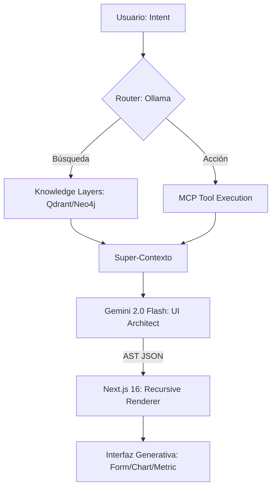

# 🐺 Nahual.AI: The Shape-Shifting Interface

> **Proyecto desarrollado para el Generative UI Global Hackathon**  
> *Transformando la interacción humano-IA de burbujas de texto estáticas a interfaces vivas que cambian de forma.*

---


## Interfaz de Chat

<p align="center">
  
</p>


---

## 🎭 El Concepto: ¿Por qué Nahual?

En la mitología mesoamericana, el **Nahual** es un ser con la capacidad de transformarse, de cambiar su forma para adaptarse a su entorno y propósito. 

**Nahual.AI** aplica esta filosofía a la informática moderna. Creemos que la era de las interfaces de usuario estáticas ha terminado. En lugar de forzar al usuario a navegar por menús rígidos o leer párrafos interminables de texto, nuestra arquitectura **"Shapeshifter"** construye la interfaz perfecta en tiempo real, basándose exclusivamente en la intención del usuario y el contexto de los datos.

---

## 🚀 La Propuesta: Más allá del Chat

La mayoría de los agentes de IA hoy viven atrapados en burbujas de chat. **Nahual.AI** rompe esa barrera mediante una arquitectura **100% Server-Driven UI (SDUI)** de alto rendimiento.

### Pilares Tecnológicos:
1.  **Orquestación Agentica (LangGraph)**: Un grafo de decisión complejo que separa la intención (Routing), la recuperación de datos (GraphRAG) y la síntesis visual.
2.  **Protocolo MCP (Model Context Protocol)**: Integración dinámica de herramientas. El sistema descubre y ejecuta herramientas en tiempo real, inyectando los resultados directamente en la fase de generación de UI.
3.  **Motor de Síntesis Visual (Gemini 2.0 Flash)**: Utilizamos el razonamiento estructural de Gemini para transformar datos crudos en un AST (Abstract Syntax Tree) de componentes React listos para ser renderizados.
4.  **Inferencia Híbrida**: Router local con **Ollama (Gemma 2b)** para latencia ultra-baja (<300ms) y modelos de frontera para el razonamiento complejo.

---

## 🛠 Arquitectura del Sistema

El flujo de **Nahual.AI** no es una simple respuesta de texto, es una metamorfosis:



### Stack de "Vanguardia":
*   **Frontend**: Next.js 16 (Canary), React 19, Tailwind 4, Framer Motion.
*   **Backend**: FastAPI, Python 3.12, LangGraph.
*   **Herramientas**: MCP (Model Context Protocol) via HTTP Streamable.
*   **Bases de Datos**: PostgreSQL (Relacional), Redis (State), Qdrant (Vectorial), Neo4j (Grafos).
*   **Observabilidad**: Langfuse (LLM Tracing), Grafana + Prometheus (Infra), NVIDIA DCGM (GPU).

---

## ✨ Características Principales

*   **⚡ Latencia "Zero-Draft"**: Pipeline de streaming SSE que renderiza componentes mientras la IA aún está razonando.
*   **🧩 Catálogo de Componentes Recursivos**: Capacidad de anidar Card, Charts, Forms y Metrics dinámicamente.
*   **🔍 GraphRAG Nativo**: No solo buscamos texto; entendemos las relaciones entre entidades gracias a Neo4j.
*   **🛡 Guardrails de Diseño**: Los componentes se generan bajo un contrato estricto de Pydantic, garantizando que la UI siempre sea funcional y visualmente premium.
*   **🌐 Ecosistema MCP**: Conexión plug-and-play con cualquier herramienta que hable el protocolo MCP (Finanzas, Inventarios, Logs, etc).

---

## 📦 Instalación y Despliegue

### Requisitos
*   Docker & Docker Compose.
*   NVIDIA GPU (para Ollama local).
*   `GEMINI_API_KEY` configurada en el `.env`.

### Quick Start
```bash
# 1. Clonar y configurar
git clone https://github.com/nahual-ai/generative-ui-hackathon
cp .env.example .env

# 2. Levantar la infraestructura (21 servicios)
make up

# 3. Descargar modelos locales
make update-models
```

Accede al portal en: `http://localhost:3000`

---

## 👥 El Equipo: Nahual.AI

Somos un equipo apasionado por la intersección entre el diseño generativo y la ingeniería de agentes.

*   **Líder de Arquitectura**: [Nombre]
*   **Frontend & UX**: [Nombre]
*   **AI Ops & Backend**: [Nombre]

---

## 📜 Licencia y Hackathon

Este proyecto fue creado exclusivamente para el **Generative UI Global Hackathon**. 
© 2026 Equipo Nahual.AI.

> *"La interfaz no es algo que navegas, es algo que te escucha y se transforma para ti."*
